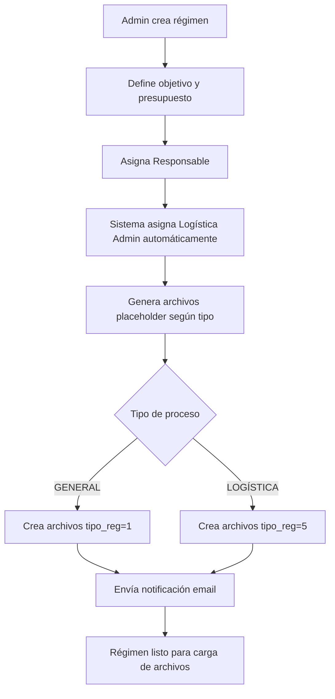
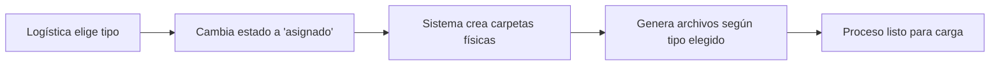

# SIS_DIAF - Sistema de Gestión Documental

Sistema de gestión de archivos y procesos para la Dirección de la Industria Aeronáutica de la Fuerza Aérea (DIAF) de Ecuador. Gestiona flujos de trabajo basados en roles para regímenes especiales de adquisiciones, contratos y servicios, con control estricto de documentación y auditoría.

## 📋 Tabla de Contenidos

- [Características Principales](#-características-principales)
- [Arquitectura del Sistema](#-arquitectura-del-sistema)
- [Tecnologías Utilizadas](#-tecnologías-utilizadas)
- [Requisitos Previos](#-requisitos-previos)
- [Instalación](#-instalación)
- [Configuración](#-configuración)
- [Modelo de Datos](#-modelo-de-datos)
- [Flujo de Negocio](#-flujo-de-negocio)
- [Roles y Permisos](#-roles-y-permisos)
- [Estructura del Proyecto](#-estructura-del-proyecto)
- [Seguridad](#-seguridad)
- [Mejoras Futuras](#-mejoras-futuras)

---

## 🚀 Características Principales

### Gestión de Regímenes
- **Creación y asignación** de procesos de adquisición con presupuesto y objetivos definidos
- **Tipos de proceso**: GENERAL, LOGÍSTICA, BIENES, SERVICIOS, MANTENIMIENTO
- **Sistema de prioridades** para carga secuencial de documentos
- **Asignación automática** de responsables y flujos de trabajo

### Control Documental
- **Solo archivos PDF**, máximo 3MB por documento
- **Versionado automático**: histórico de cambios en archivos
- **Estados de archivo**: Sin archivo, pendiente, vacío, subido
- **Almacenamiento estructurado** por código de régimen y tipo de proceso
- **Validación de integridad** de archivos y metadata

### Sistema de Roles
- **7 roles diferenciados**: Administrador, Supervisor, Responsable, Logística, Logística Administrador, Finanzas, Jurídico
- **Permisos granulares** por tipo de documento y acción
- **Workflow basado en roles** con asignaciones automáticas

### Seguridad y Auditoría
- **Encriptación de contraseñas** con hash seguro
- **URLs encriptadas** para protección de parámetros
- **Sistema de bloqueo** por intentos fallidos de login (3 intentos)
- **Auditoría completa** con tabla de histórico de cambios
- **Autenticación por cookies** con timeout configurable

### Reportería
- **Generación de PDFs** con información completa del régimen
- **Búsqueda y filtrado avanzado** por múltiples criterios
- **Paginación optimizada** para grandes volúmenes de datos

---

## 🏗️ Arquitectura del Sistema

### Patrón de Diseño
El sistema implementa una arquitectura en capas utilizando los siguientes patrones:

```
┌─────────────────────────────────────────┐
│         Presentation Layer              │
│    (Controllers + Razor Views)          │
└─────────────────┬───────────────────────┘
                  │
┌─────────────────▼───────────────────────┐
│          Service Layer                  │
│   (Business Logic + Services)           │
└─────────────────┬───────────────────────┘
                  │
┌─────────────────▼───────────────────────┐
│       Data Access Layer                 │
│    (Repositories + EF Core)             │
└─────────────────┬───────────────────────┘
                  │
┌─────────────────▼───────────────────────┐
│         Data Layer                      │
│      (SQL Server Database)              │
└─────────────────────────────────────────┘
```

### Componentes Principales

- **Controllers**: Manejo de peticiones HTTP y flujo de navegación
- **Repositories**: Implementación del patrón Repository para acceso a datos
- **Services**: Lógica de negocio transversal (Email, Sesión, Encriptación)
- **Models**: Entidades de dominio y contexto de EF Core
- **DTOs**: Objetos de transferencia de datos entre capas
- **Utilities**: Funcionalidades auxiliares (Upload, PDF, Ordenamiento)

---

## 💻 Tecnologías Utilizadas

### Backend
- **.NET 10.0** - Framework principal
- **ASP.NET Core MVC** - Patrón arquitectónico
- **Entity Framework Core 10.0** - ORM
- **SQL Server** - Base de datos relacional

### Seguridad
- **ASP.NET Core Identity** - Gestión de autenticación
- **Cookie Authentication** - Gestión de sesiones
- **Data Protection API** - Protección de datos sensibles

### Librerías Destacadas
- **MailKit 4.14.1** - Envío de correos electrónicos
- **Select.HtmlToPdf.NetCore 25.2.0** - Generación de reportes PDF
- **Microsoft.AspNetCore.Authentication.JwtBearer** - Soporte JWT (configurado)
- **Newtonsoft.Json** - Serialización JSON

### Frontend
- **Bootstrap 5** - Framework CSS
- **jQuery 3.x** - Manipulación DOM
- **SweetAlert2** - Alertas y notificaciones
- **JavaScript vanilla** - Validaciones custom

---

## 📦 Requisitos Previos

- **.NET SDK 10.0** o superior
- **SQL Server 2019** o superior (puerto personalizado 1434)
- **Visual Studio 2022** o **JetBrains Rider** (recomendado)
- **Node.js** (opcional, para gestión de librerías frontend)

---

## 🔧 Instalación

### 1. Clonar el Repositorio

```bash
git clone <url-del-repositorio>
cd FileManagement
```

### 2. Restaurar Dependencias

```bash
dotnet restore
```

### 3. Configurar Base de Datos

Editar `appsettings.json` con tus credenciales:

```json
{
  "ConnectionStrings": {
    "CadenaConexion": "Server=localhost,1434;user ID=tu_usuario;password=tu_password;Database=DB_FileManagement;Trusted_Connection=False;TrustServerCertificate=False;Encrypt=False"
  },
  "Sucursal": 1
}
```

**IMPORTANTE**: En producción, usar **User Secrets** o variables de entorno para credenciales.

### 4. Aplicar Migraciones

```bash
dotnet ef database update
```

El sistema ejecutará automáticamente los seeds de datos iniciales al arrancar.

### 5. Ejecutar Aplicación

```bash
dotnet run
```

La aplicación estará disponible en `https://localhost:5001` (o el puerto configurado).

---

## ⚙️ Configuración

### Configuración de Almacenamiento

En `appsettings.json` (añadir estas secciones):

```json
{
  "FileStorage": "C:\\Storage\\FileManagement",
  "WebStorageRoot": "Storage"
}
```

### Configuración de Email

El sistema utiliza credenciales encriptadas almacenadas en la tabla `ServicioCorreo`. Para modificarlas:

1. Actualizar en el seed (`Seed/SeederDiaf.cs`)
2. Limpiar base de datos y re-ejecutar seeds

```csharp
string email = "tu_email@diaf.gob.ec";
string credenciales = "tu_password";
string host = "tu_host_smtp";
```

### Usuario Inicial

El sistema crea automáticamente un usuario administrador:

- **Usuario**: 1003896931 (cédula)
- **Contraseña**: Tec$212@001
- **Rol**: Administrador

**CRÍTICO**: Cambiar estas credenciales en producción.

---

## 📊 Modelo de Datos

### Entidades Principales

#### **Regimen**
Representa un proceso/expediente de adquisición.

```csharp
public class Regimen
{
    public long regimen_id { get; set; }           // PK
    public string regimen_guid { get; set; }       // Identificador único global
    public string regimen_cod { get; set; }        // Código formato: RE-CEP-CGFAE-DD-YYYY-HHMMSS
    public decimal regimen_presupuesto { get; set; }
    public string regimen_objetivo { get; set; }
    public DateTime regimen_fecha_creacion { get; set; }
    
    // Navegación
    public ICollection<Archivo> Archivos { get; set; }
    public ICollection<ResponsableRegimen> responsableRegimen { get; set; }
}
```

#### **Archivo**
Documento PDF asociado a un régimen.

```csharp
public class Archivo
{
    public long archivo_id { get; set; }
    public string archivo_guid { get; set; }
    public string archivo_nombre { get; set; }
    public string archivo_ruta { get; set; }
    public DateTime fecha_subida { get; set; }
    public string archivo_estado { get; set; }  // "Sin archivo", "pendiente", "vacio", "subido"
    
    // FK
    public long RegimenId { get; set; }
    public long TipoArchivoId { get; set; }
}
```

#### **Usuario**
Usuarios del sistema con control de acceso.

```csharp
public class Usuario
{
    public long usuario_id { get; set; }
    public Guid usuario_guid { get; set; }
    public string usuario_nombre { get; set; }
    public string usuario_cedula { get; set; }    // Login username
    public string usuario_email { get; set; }
    public string usuario_celular { get; set; }
    public string usuario_passwd { get; set; }    // Hasheada
    public string usuario_estado { get; set; }    // "activo" / "inactivo"
    public int usuario_nIntentos { get; set; }    // Control de bloqueo (default: 3)
    
    // FK
    public long RolId { get; set; }
    public long SucursalId { get; set; }
}
```

#### **ResponsableRegimen** (Tabla Pivote)
Asigna usuarios a regímenes.

```csharp
public class ResponsableRegimen
{
    public long Usuariousuario_id { get; set; }
    public long Regimenregimen_id { get; set; }
    public string responsableReg_codigoRegimen { get; set; }  // GUID del régimen
    public string responsableReg_estado { get; set; }         // "asignado" / "pendiente"
}
```

#### **TipoArchivo**
Define los tipos de documentos requeridos.

```csharp
public class TipoArchivo
{
    public long tipoarchivo_id { get; set; }
    public string tipo_nombre { get; set; }
    public int tip_prioridad { get; set; }       // Orden secuencial de carga
    
    // FK
    public long TipoRegId { get; set; }          // Relaciona con tipo de proceso
}
```

#### **Historico**
Auditoría de cambios en archivos (versionado).

```csharp
public class Historico
{
    public long historico_id { get; set; }
    public string historico_archivoRuta { get; set; }
    public string historico_guidRegimen { get; set; }
    public string historico_guidArchivo { get; set; }
    public string historico_tipoArchivo { get; set; }
    public DateTime historico_fecha { get; set; }
}
```

### Tipos de Régimen

| ID | Tipo | Descripción |
|----|------|-------------|
| 1 | GENERAL | Documentos base del régimen |
| 2 | SERVICIOS | Proceso de contratación de servicios |
| 3 | BIENES | Proceso de adquisición de bienes |
| 4 | MANTENIMIENTO | Proceso de contratación de mantenimiento |
| 5 | LOGÍSTICA | Documentos auxiliares de logística |

---

## 🔄 Flujo de Negocio

### 1. Creación de Régimen



### 2. Carga de Archivos (Sistema de Prioridades)

El sistema implementa una **carga secuencial obligatoria**:

1. Solo archivos con `tip_prioridad = 1` están en estado "pendiente" inicialmente
2. Al subir un archivo exitosamente, pasa a "subido"
3. El sistema automáticamente habilita el siguiente (`tip_prioridad + 1`)
4. Archivos opcionales tienen estado "vacio" desde el inicio

**Ejemplo de secuencia**:
```
Prioridad 1: SOLICITUD DE REQUERIMIENTO    [pendiente] → [subido] ✓
Prioridad 2: CERTIFICACIÓN PRESUPUESTARIA  [vacio] → [pendiente] → [subido] ✓
Prioridad 3: INFORME DE NECESIDAD          [vacio] → [pendiente] → ...
```

### 3. Asignación de Proceso de Logística

Cuando el perfil "Logística" elige el tipo de proceso (BIENES/SERVICIOS/MANTENIMIENTO):



**Estructura de carpetas creada**:
```
Storage/
└── {codigo_regimen}/
    ├── GENERAL/
    │   ├── SOLICITUD DE REQUERIMIENTO/
    │   ├── CERTIFICACIÓN PRESUPUESTARIA/
    │   └── ...
    ├── BIENES/  (o SERVICIOS/MANTENIMIENTO)
    │   ├── PROFORMA/
    │   ├── CUADRO COMPARATIVO/
    │   └── COTIZACIÓN/
    └── LOGÍSTICA/
        ├── ORDEN DE COMPRA/
        └── ...
```

### 4. Workflow Completo

```
1. ADMIN/SUPERVISOR
   ↓ Crea régimen y asigna responsable
   
2. RESPONSABLE
   ↓ Sube archivos GENERALES (tipo_reg=1)
   
3. LOGÍSTICA
   ↓ Elige tipo proceso y sube archivos específicos (tipo_reg=2,3,4)
   
4. LOGÍSTICA ADMIN
   ↓ Sube archivos auxiliares (tipo_reg=5)
   
5. FINANZAS
   ↓ Sube LIQUIDACIÓN
   
6. JURÍDICO
   ↓ Sube CONTRATO FAE-DIAF
   
7. RÉGIMEN COMPLETADO
```

---

## 👥 Roles y Permisos

### Matriz de Permisos

| Rol | Crear Régimen | Ver Todos | Ver Asignados | Subir General | Subir Logística | Subir Finanzas | Subir Jurídico | Asignar Usuarios |
|-----|---------------|-----------|---------------|---------------|-----------------|----------------|----------------|------------------|
| **Administrador** | ✅ | ✅ | ✅ | ✅ | ✅ | ✅ | ✅ | ✅ |
| **Supervisor** | ✅ | ✅ | ✅ | ❌ | ❌ | ❌ | ❌ | ✅ |
| **Responsable** | ❌ | ❌ | ✅ | ✅ | ❌ | ❌ | ❌ | ❌ |
| **Logística** | ❌ | ❌ | ✅ | ❌ | ✅ | ❌ | ❌ | ❌ |
| **Logística Admin** | ❌ | ❌ | ✅ | ❌ | ✅* | ❌ | ❌ | ❌ |
| **Finanzas** | ❌ | ✅ | ❌ | ❌ | ❌ | ✅ | ❌ | ❌ |
| **Jurídico** | ❌ | ✅ | ❌ | ❌ | ❌ | ❌ | ✅ | ❌ |

*Solo archivos auxiliares de logística (tipo_reg=5)

### Descripciones de Roles

#### **Administrador**
- Acceso completo al sistema
- CRUD de usuarios, regímenes y configuraciones
- Visualización de todos los procesos
- Asignación de responsables

#### **Supervisor**
- Creación de regímenes
- Asignación de responsables
- Visualización general (sin carga de archivos)
- Reportería completa

#### **Responsable**
- Visualiza solo regímenes asignados
- Sube archivos GENERALES del régimen
- Seguimiento de progreso

#### **Logística**
- Visualiza regímenes asignados
- Elige tipo de proceso (BIENES/SERVICIOS/MANTENIMIENTO)
- Sube archivos del tipo elegido
- Requiere asignación previa de "Logística Admin"

#### **Logística Administrador**
- Asignación automática en todos los regímenes
- Sube 3 archivos auxiliares (tipo_reg=5)
- Solo debe existir **uno en el sistema**

#### **Finanzas**
- Visualiza todos los regímenes
- Sube únicamente documento "LIQUIDACIÓN"

#### **Jurídico**
- Visualiza todos los regímenes
- Sube únicamente documento "CONTRATO FAE-DIAF"

---

## 📁 Estructura del Proyecto

```
FileManagement/
│
├── 📂 Caching/
│   └── CacheCompartida.cs              # Implementación cache compartido (nivel 2)
│
├── 📂 Controllers/                      # Controladores MVC (15 archivos)
│   ├── AccesoUsuarioController.cs      # Control de acceso denegado
│   ├── AdministradorController.cs      # CRUD usuarios y roles
│   ├── ComercioController.cs           # Funcionalidades comerciales
│   ├── FinanzasController.cs           # Gestión finanzas
│   ├── FormularioController.cs         # Login y autenticación
│   ├── HistoricoController.cs          # Auditoría y versionado
│   ├── JuridicoController.cs           # Gestión documentos jurídicos
│   ├── LogisticaController.cs          # Workflow logística
│   ├── LogisticaAdminController.cs     # Archivos auxiliares logística
│   ├── OmaController.cs                # Funcionalidades OMA
│   ├── RegimensController.cs           # CRUD regímenes (core)
│   ├── RolController.cs                # Gestión de roles
│   ├── StorageController.cs            # Acceso a archivos físicos
│   ├── UploadController.cs             # Carga de archivos
│   └── UsuarioController.cs            # Gestión de usuarios
│
├── 📂 DTO/                              # Data Transfer Objects
│   ├── DTOVEIW/
│   │   └── DtoViewRegimen.cs           # DTO vista régimen
│   ├── LoginDto.cs                     # Datos login
│   ├── PerfilUsuarioDto.cs             # Perfil usuario sesión
│   ├── ProcesosEnCursoDto.cs           # Procesos activos
│   ├── RegistroRolDto.cs               # Registro de roles
│   ├── RegistroUsuarioDto.cs           # Registro de usuarios
│   ├── RequesRegimen.cs                # Request creación régimen
│   └── RequestArchivo.cs               # Request carga archivo
│
├── 📂 Migrations/                       # Migraciones EF Core
│   ├── 20251113220557_Migracion-configuracion.cs
│   └── SistemaDiafContextModelSnapshot.cs
│
├── 📂 Models/                           # Entidades de dominio
│   ├── ModelViews/                     # ViewModels
│   │   ├── HistoricoViews.cs
│   │   ├── RegimenCompletadosModelView.cs
│   │   ├── RolesModelViews.cs
│   │   └── UsuariosModelViews.cs
│   ├── Archivo.cs                      # Entidad Archivo
│   ├── Historico.cs                    # Entidad Historico
│   ├── Regimen.cs                      # Entidad Regimen ⭐
│   ├── ResponsableRegimen.cs           # Tabla pivote
│   ├── Rol.cs                          # Entidad Rol
│   ├── ServicioCorreo.cs               # Configuración email
│   ├── SistemaDiafContext.cs           # DbContext principal
│   ├── Sucursal.cs                     # Entidad Sucursal
│   ├── TipoArchivo.cs                  # Tipos de documentos
│   ├── TipoReg.cs                      # Tipos de régimen
│   └── Usuario.cs                      # Entidad Usuario
│
├── 📂 Repositorios/                     # Capa de acceso a datos
│   ├── ICorreoRepository.cs            # Interface correo
│   ├── ILogin.cs                       # Interface login
│   ├── IRepositorio.cs                 # Interface genérica
│   ├── IResponsableRegimen.cs          # Interface responsable
│   ├── RArchivo.cs                     # Repositorio archivos
│   ├── RCorreo.cs                      # Repositorio correo
│   ├── RHistorico.cs                   # Repositorio histórico
│   ├── RRegimen.cs                     # Repositorio regímenes ⭐
│   ├── RResponsableRegimen.cs          # Repositorio asignaciones
│   ├── RRol.cs                         # Repositorio roles
│   ├── RSucuarsales.cs                 # Repositorio sucursales
│   ├── RTipoArchivo.cs                 # Repositorio tipos archivo
│   └── RUsuario.cs                     # Repositorio usuarios
│
├── 📂 Security/                         # Seguridad
│   └── EncriptacionPass.cs             # Encriptación contraseñas/datos
│
├── 📂 Seed/                             # Datos iniciales
│   └── SeederDiaf.cs                   # Seeder principal
│
├── 📂 Services/                         # Servicios de negocio
│   ├── EmailServicio.cs                # Envío de emails
│   ├── IEmailService.cs                # Interface email
│   ├── ISesion.cs                      # Interface sesión
│   └── SesionService.cs                # Gestión de sesiones
│
├── 📂 Transact-SQL/                     # Scripts SQL
│   ├── SeedRol.sql                     # Seed roles
│   ├── SeedSucursales.sql              # Seed sucursales
│   ├── SeedTipoArchivo.sql             # Seed tipos archivo
│   ├── SeedTipoReg.sql                 # Seed tipos régimen
│   └── SeedUsuarios.sql                # Seed usuarios
│
├── 📂 Utilities/                        # Utilidades
│   ├── GestionarEncriptado.cs          # Encriptación URLs
│   ├── HtmlPdfGenerator.cs             # Generación PDFs
│   ├── Ordenar.cs                      # Paginación y ordenamiento
│   └── UploadFiles.cs                  # Gestión archivos físicos ⭐
│
├── 📂 ViewComponents/                   # Componentes reutilizables
│   └── FormularioRolViewComponent.cs   # Formulario roles
│
├── 📂 Views/                            # Vistas Razor
│   ├── Shared/                         # Layouts compartidos
│   │   ├── _Layout.cshtml              # Layout principal
│   │   ├── _Layout2.cshtml             # Layout alternativo
│   │   └── _Layout3.cshtml             # Layout alternativo 2
│   ├── AccesoUsuario/
│   ├── Administrador/
│   ├── Formulario/
│   ├── Historico/
│   ├── Home/
│   ├── Logistica/
│   ├── LogisticaAdmin/
│   ├── Regimens/                       # Vistas principales régimen
│   ├── Rol/
│   ├── Upload/                         # Vistas carga archivos
│   └── Usuario/
│
├── 📂 wwwroot/                          # Recursos estáticos
│   ├── css/                            # Hojas de estilo custom
│   ├── images/                         # Imágenes y logos
│   ├── js/                             # JavaScript custom
│   └── lib/                            # Librerías frontend
│       ├── bootstrap/
│       ├── jquery/
│       ├── jquery-validation/
│       ├── sweetalert2/
│       └── ...
│
├── Program.cs                           # Punto de entrada ⭐
├── SIS_DIAF.csproj                     # Archivo de proyecto
├── appsettings.json                    # Configuración
├── libman.json                         # Gestión librerías frontend
└── README.md                           # Este archivo
```

**⭐ = Archivos core del sistema**

---

## 🔒 Seguridad

### Autenticación y Autorización

#### Sistema de Autenticación
- **Cookie-based authentication** con esquema `CookieAuthenticationDefaults`
- **Timeout de sesión**: 5 minutos de inactividad
- **Persistencia configurable**: Opción "Mantener sesión iniciada"
- **Claims personalizados**: UsuarioID, Role, Cedula, Nombres

#### Control de Acceso
```csharp
// Ejemplo de autorización por rol
[Authorize(Roles = "administrador,supervisor")]
public async Task<IActionResult> Guardar(RequesRegimen reg)
{
    // Solo administradores y supervisores pueden crear regímenes
}
```

#### Sistema de Bloqueo
- **Intentos permitidos**: 3 intentos fallidos
- **Acción**: Usuario pasa a estado "inactivo"
- **Desbloqueo**: Solo por administrador

### Protección de Datos

#### Encriptación
```csharp
// Contraseñas
public class EncriptacionPass
{
    public string EncriptarPassword(string password)  // Hash irreversible
    public bool ValidarPassword(string password, string hash)
}

// Datos sensibles (emails, hosts)
public string EncriptarDatos(string data)  // Encriptación reversible
public string DesencriptarDatos(string encryptedData)
```

#### URLs Encriptadas
Todos los parámetros de URL sensibles se encriptan:
```csharp
// Antes: /Regimens/Index?pagina=1&tipo=2&entrada=objetivo
// Después: /Regimens/Index?pagina=X8jK...&tipo=9mL2...&entrada=pQ4n...

public class GestionarEncriptado
{
    public Dictionary<string, string> SeguridadEncriptado(Dictionary<string, string> datos)
    {
        // Valida y desencripta parámetros
        // Si falla validación, retorna null
    }
}
```

### Protección contra Ataques

#### CSRF Protection
```html
<!-- Todas las formas POST incluyen token anti-forgery -->
@Html.AntiForgeryToken()
```

```csharp
[HttpPost]
[ValidateAntiForgeryToken]
public async Task<IActionResult> GuardarArchivo(RequestArchivos req)
```

#### Validación de Archivos
```csharp
// Validaciones en RArchivo.Upload()
- Solo extensión .pdf
- Tamaño máximo: 3MB (3 * 1024 * 1024 bytes)
- Validación de GUID de archivo
- Verificación de permisos de usuario
```

#### SQL Injection
- **EF Core parametriza automáticamente** todas las consultas LINQ
- Scripts SQL raw solo para seeds (sin input de usuario)

### Recomendaciones de Producción

#### ⚠️ CRÍTICO - Cambiar antes de desplegar:

1. **Credenciales de Base de Datos**
   ```bash
   # Usar User Secrets en desarrollo
   dotnet user-secrets set "ConnectionStrings:CadenaConexion" "tu_cadena_produccion"
   
   # Usar Variables de Entorno en producción
   export ConnectionStrings__CadenaConexion="Server=..."
   ```

2. **Usuario Administrador Inicial**
   - Cambiar contraseña por defecto: `Tec$212@001`
   - Modificar en `Seed/SeederDiaf.cs` antes del primer deploy

3. **Credenciales de Email**
   - Almacenar en secretos o configuración segura
   - No hardcodear en código fuente

4. **HTTPS Obligatorio**
   ```csharp
   // Añadir en Program.cs
   app.UseHttpsRedirection();
   app.UseHsts();
   ```

5. **Rate Limiting**
   ```csharp
   // Implementar limitación de peticiones para login
   services.AddRateLimiter(options => {
       options.AddFixedWindowLimiter("login", opt => {
           opt.Window = TimeSpan.FromMinutes(1);